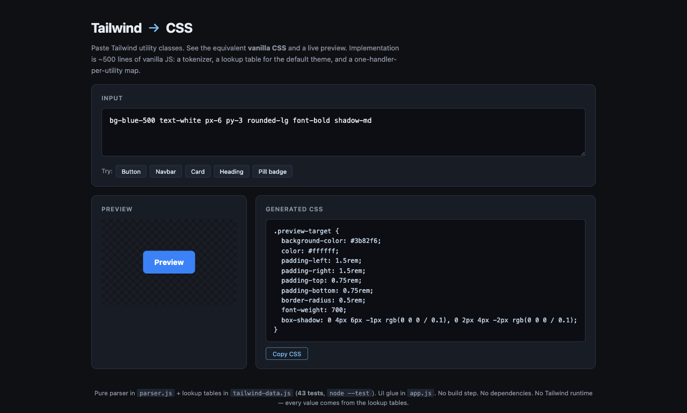

# tw-to-css

[](https://sen.ltd/portfolio/tw-to-css/)

Paste Tailwind utility classes, get vanilla CSS — with a live preview.

**Live demo**: https://sen.ltd/portfolio/tw-to-css/



## 特徴

- Pure parser in `parser.js` — no DOM, no browser dependency
- Subset of Tailwind v3 default theme (~100 utilities covering spacing, colours, layout, typography, borders, radius, shadow)
- 43 unit tests covering tokenisation, every utility category, unknown-class collection, and CSS rendering
- Live preview that uses the resolved declarations directly (no Tailwind runtime, no JIT)
- "Last class wins" same-property override (matches Tailwind's intuition without specificity tricks)
- Zero dependencies, no build step

## ローカル起動

```sh
npm run serve
# → http://localhost:8080
```

## テスト

```sh
npm test
```

## アーキテクチャ

```
tailwind-data.js  ← Tailwind v3 既定テーマのサブセット（カラーパレット、スペーシング、フォント等）
parser.js         ← トークナイザ + クラス → CSS 宣言マップ（DOM 非依存、テスト可能）
app.js            ← UI グルー（入力 → parser → preview / output）
```

`parser.js` の各ユーティリティは「ハンドラ関数」として登録される。1 ユーティリティ = 1 ハンドラ。新ルール追加は配列に push するだけで、テストも同じ粒度で書ける。

## ライセンス

MIT. See [LICENSE](./LICENSE).

<!-- sen-publish:links -->
## Links

- 🌐 Demo: https://sen.ltd/portfolio/tw-to-css/
- 📝 記事: https://qiita.com/sen-ltd/items/727f23ea8fa9e582ea3a
- 📝 dev.to: https://dev.to/sendotltd/building-a-mini-tailwind-to-css-converter-how-utility-class-names-map-to-real-css-46ak
<!-- /sen-publish:links -->
